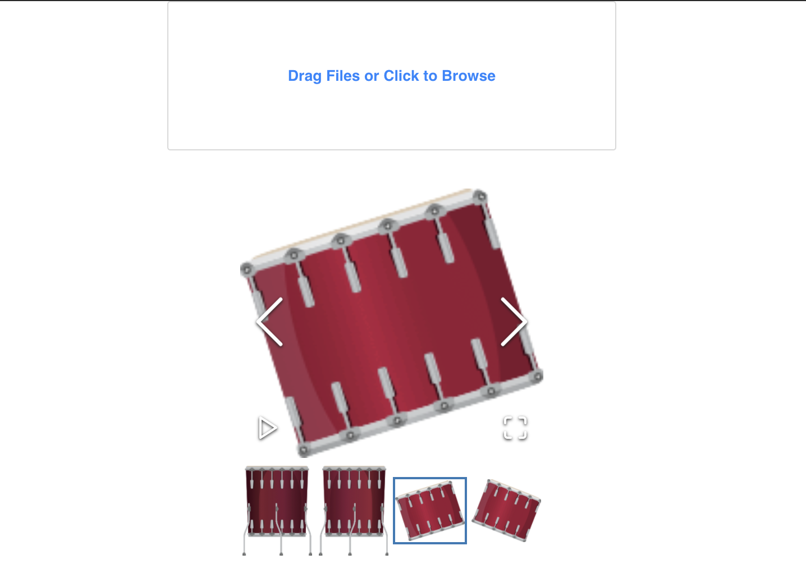

# demo app - Full stack images upload and gallery application  with React, Node.js, PostgreSQL in Amazon RDS, storing images in Amazon S3 bucket, Sequelize.

This demo app shows a simple images gallery. It allows to upload images and list it. 

* React frontend for handling the image gallery and uploads 
* Nodejs backend REST API that connects to the database via Sequelize
* S3 Bucket for storing files
* PostgreSQL database for storing the file metadata in Amazon RDS



## Getting Started

### Create s3 bucket in aws

### Create the RDS PostgreSQL Instance

### Connect to a PostgreSQL DB instance using pgAdmin or psql and create database and user role for database. With psql:
* Connect to PostgreSQL as root: 

```sh
psql -h AWS-RDS-DB-instance-identifier  -U postgres;
```
* Create database
```sh
create database "name-of-database";
```
* Create user role and give database's ownership to this role
```sh
create user "name-of-user" with password 'password';
```
```sh
alter database "name-of-database" owner to "name-of-user";
```
### Clone or download this repository

```sh
git clone https://github.com/
```

### Install dependencies in backend

```sh
cd backend
```
```sh
npm install
```
### Install dependencies in frontend
```sh
cd frontend
```
```sh
yarn install
```
### Change name of backend/.env.example file to backend/.env and complete it with your environment variables
### Add tables to database with sequelize-cli: 
```sh
cd backend
```
```sh
npx sequelize-cli db:migrate
```
### Run the frontend locally and then go to http://localhost:3000/ in your browser
```sh
cd frontend
```
```sh
yarn start
```
### Run the backend locally and then go to http://localhost:8001/ in your browser
```sh
cd backend
```
```sh
npm run dev
```

Based on and modified: https://medium.com/swlh/build-an-image-upload-application-with-react-nodejs-postgresql-and-s3-34fe13fbe572
and https://github.com/mbrown3321/image-upload-api, https://github.com/mbrown3321/image-upload-ui